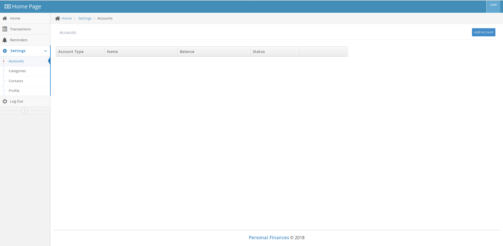
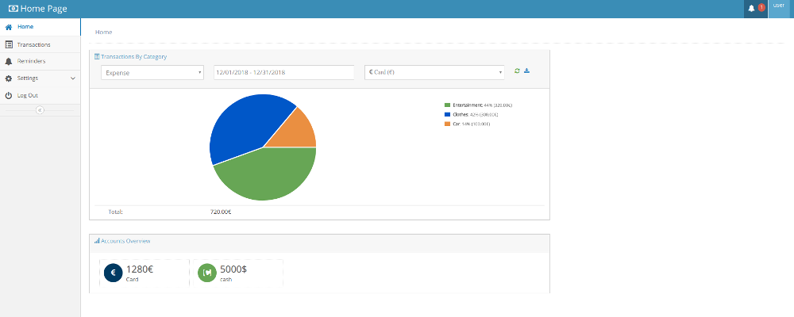

# PersonalFinances

PersonalFinances is a personal finance tracker build with:
+ <a href="https://spring.io/projects/spring-boot" target="_blank">Spring Boot</a>
+ <a href="https://spring.io/guides/gs/relational-data-access/" target="_blank">Spring JDBC</a>
+ <a href="https://www.thymeleaf.org/" target="_blank">Thymeleaf</a>
+ <a href="https://spring.io/projects/spring-security" target="_blank">Spring Security</a>
+ <a href="http://getbootstrap.com/" target="_blank">Twitter Bootstrap</a>
+ <a href="http://ace.jeka.by/" target="_blank">Ace Admin</a>

### Required softwares

	a) java 11
	b) application server - apache-tomcat-Apache 8/9
	c) database server - mysql 8

### Running application
 Run the following scripts in setup/db/ folder:
 
    database_schema.sql 
	inserts.sql

 Set configuration settings in support/HOME/config/
    
    application.properties 
    
For running application from IDE set environment variables

    SPRING_CONFIG_LOCATION=/PATH_TO/HOME/config/
    SPRING_CONFIG_NAME=application

For running application from command line

    java -jar personalfinances.jar --spring.config.location=/PATH_TO/HOME/config/ --spring.config.name=application
    
Or copy setup/personalfinances.conf to directory where the personalfinances.jar is located, change LOG_FOLDER,CONF_FOLDER,LOG_FILENAME,RUN_ARGS arguments in file personalfinances.conf
and run command

    ./personalfinances.jar   

You can access personalfinances at http://localhost:8080/personalfinances/

    Users 
    admin role - admin/admin
    user role - user/user

For adding transactions at first create categories, accounts, contacts from Settings menu.
Sample categories:

    Car
    Clothes
    Entertainment
    Food
    Gift
    Other
    Payments
    Shopping
    Transport

